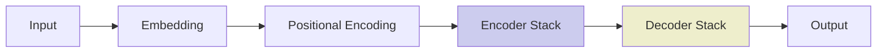
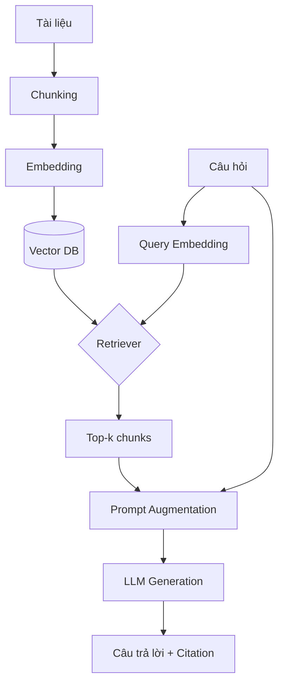
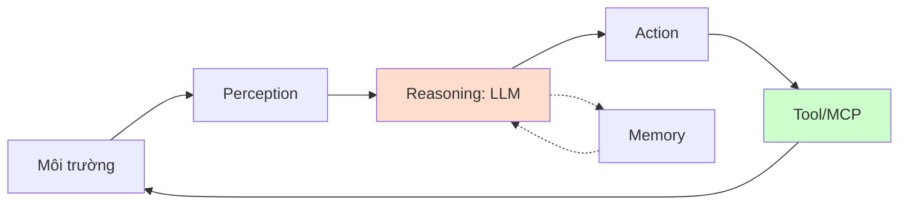
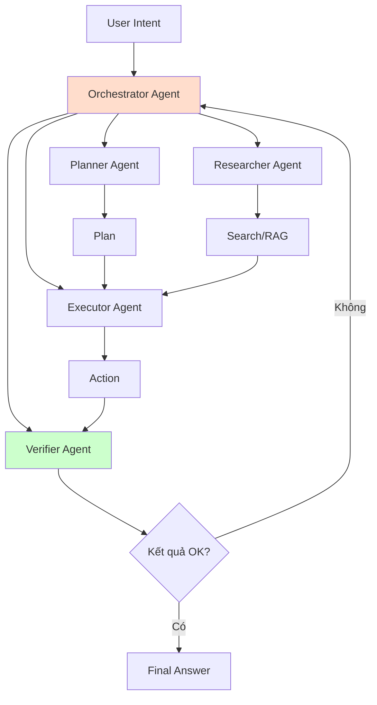
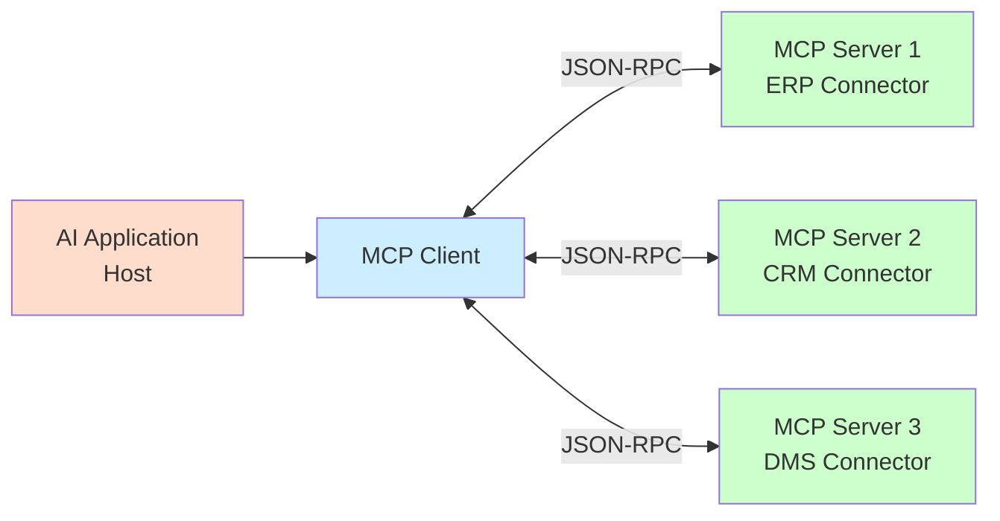

# Chương 1: CƠ SỞ LÝ LUẬN VÀ TỔNG QUAN NGHIÊN CỨU

Chương này trình bày các kiến thức nền tảng và tổng quan nghiên cứu liên quan, làm cơ sở cho việc đề xuất kiến trúc nền tảng ở Chương 2. Nội dung gồm: tổng quan trí tuệ nhân tạo và mô hình ngôn ngữ lớn; kỹ thuật Retrieval-Augmented Generation (RAG); AI Agent và Multi-Agent Orchestration; giao thức Model Context Protocol (MCP); tích hợp hệ thống doanh nghiệp; các nghiên cứu liên quan và khoảng trống nghiên cứu.

## 1.1. Tổng quan về trí tuệ nhân tạo và mô hình ngôn ngữ lớn

### 1.1.1. Khái quát về trí tuệ nhân tạo

Trí tuệ nhân tạo (Artificial Intelligence – AI) là một lĩnh vực của khoa học máy tính nhằm nghiên cứu và phát triển các hệ thống có khả năng thực hiện những tác vụ đòi hỏi trí thông minh của con người như: học tập, suy luận, nhận thức, hiểu ngôn ngữ tự nhiên, lập kế hoạch và ra quyết định [1]. Trải qua nhiều giai đoạn phát triển (từ hệ chuyên gia, học máy truyền thống đến học sâu và hiện nay là mô hình nền tảng – Foundation Models), AI đã có những bước tiến vượt bậc, đặc biệt là từ năm 2017 với sự ra đời của kiến trúc Transformer [2].

Các mốc son trong lịch sử phát triển AI hiện đại:

- **2017**: kiến trúc Transformer được giới thiệu qua bài báo *"Attention is All You Need"* [2], đặt nền móng cho các mô hình ngôn ngữ sau này.
- **2018**: BERT – mô hình ngôn ngữ hai chiều mã hóa sâu – ra đời, đánh dấu bước tiến trong hiểu ngôn ngữ tự nhiên.
- **2020**: GPT-3 [4] chứng minh khả năng few-shot learning của các mô hình ngôn ngữ lớn, mở ra kỷ nguyên prompt engineering.
- **2022**: ChatGPT ra đời, đưa AI tạo sinh đến đại chúng.
- **2023–2026**: các mô hình đa phương thức (multimodal) như Gemini [5], Claude 3/4, GPT-4o/4.5, Llama 3 [25] liên tục được phát hành với khả năng ngày càng mạnh mẽ.

### 1.1.2. Mô hình ngôn ngữ lớn (LLM)

#### a) Khái niệm

Mô hình ngôn ngữ lớn (Large Language Model – LLM) là mô hình học sâu được huấn luyện trên lượng lớn dữ liệu văn bản, có khả năng sinh văn bản tự nhiên, hiểu ngữ nghĩa, lập luận logic và thực hiện các tác vụ ngôn ngữ đa dạng mà không cần huấn luyện lại từ đầu [3]. Đặc điểm chính của LLM bao gồm:

- **Quy mô tham số lớn**: từ hàng tỷ đến hàng trăm tỷ tham số.
- **Khả năng zero/few-shot learning**: có thể thực hiện tác vụ mới chỉ với vài ví dụ hoặc hướng dẫn bằng ngôn ngữ tự nhiên.
- **Cửa sổ ngữ cảnh (context window) lớn**: một số mô hình hiện đại có thể xử lý hàng triệu tokens (Gemini 2.5 Flash hỗ trợ 1M tokens).
- **Khả năng reasoning**: có thể thực hiện các tác vụ suy luận logic, toán học, lập trình.

#### b) Kiến trúc Transformer

Kiến trúc Transformer [2] là nền tảng của tất cả các LLM hiện đại. Kiến trúc này gồm hai phần chính:

- **Encoder**: mã hóa chuỗi đầu vào thành vector đặc trưng giàu ngữ nghĩa. Các mô hình như BERT sử dụng chủ yếu encoder, phù hợp cho các tác vụ hiểu ngôn ngữ.
- **Decoder**: sinh chuỗi đầu ra theo từng token, sử dụng masked self-attention. Các mô hình GPT-like sử dụng decoder-only, phù hợp cho tác vụ sinh văn bản.

Cơ chế cốt lõi là **Multi-Head Self-Attention**, cho phép mô hình cân nhắc tầm quan trọng của các token khác nhau trong chuỗi đầu vào, đồng thời xử lý song song trên GPU/TPU giúp tăng tốc đáng kể so với các kiến trúc RNN trước đó.

*Hình 1.1: Kiến trúc tổng quát của Transformer*

#### c) Quy trình huấn luyện

Quá trình tạo ra một LLM thường gồm các giai đoạn:

1. **Pre-training**: huấn luyện không giám sát trên lượng lớn dữ liệu văn bản thô (TB đến PB) với tác vụ language modeling (dự đoán token tiếp theo). Đây là giai đoạn tốn kém nhất về tài nguyên tính toán.
2. **Instruction tuning (SFT)**: tinh chỉnh trên bộ dữ liệu có cấu trúc (instruction – response) để mô hình tuân theo chỉ dẫn của người dùng.
3. **RLHF (Reinforcement Learning from Human Feedback)**: dùng phản hồi con người để huấn luyện mô hình reward, sau đó tối ưu LLM thông qua PPO hoặc DPO.
4. **Specialization (tuỳ chọn)**: tiếp tục fine-tuning trên dữ liệu chuyên ngành (y tế, pháp lý, tài chính…).

### 1.1.3. Các mô hình LLM tiêu biểu

#### a) GPT (OpenAI)

GPT-3 ra đời năm 2020 [4] chứng minh khả năng few-shot learning. GPT-4 (2023) [23] cải thiện đáng kể khả năng reasoning, có hỗ trợ đầu vào đa phương thức (hình ảnh, văn bản). GPT-4o và GPT-4.5 (2024–2025) tiếp tục giảm chi phí và cải thiện tốc độ. Đặc điểm: cửa sổ ngữ cảnh lớn (128K), chất lượng cao, API ổn định, hệ sinh thái plugin/mạnh.

#### b) Claude (Anthropic)

Claude 3 (Opus, Sonnet, Haiku) ra mắt 2024 [24] với cửa sổ 200K tokens. Claude đặc biệt mạnh về reasoning dài, an toàn (safety) và tuân thủ chỉ dẫn phức tạp. Anthropic cũng là đơn vị đề xuất giao thức MCP [12].

#### c) Gemini (Google DeepMind)

Gemini [5] có ba phiên bản: Ultra, Pro, Flash/Flash-Lite. Nổi bật với cửa sổ ngữ cảnh 1M-2M tokens cho phép xử lý tài liệu rất dài. Hỗ trợ đa phương thức gốc (text, image, audio, video). Giá rẻ với Gemini Flash.

#### d) Llama (Meta)

Llama 2, Llama 3 [25] là các mô hình mã nguồn mở, có thể tự triển khai qua Ollama, vLLM, TGI. Phù hợp cho doanh nghiệp cần bảo mật dữ liệu (on-premise) hoặc tối ưu chi phí ở quy mô lớn.

#### e) Các mô hình khác

DeepSeek (Trung Quốc), Mistral AI (Pháp), Cohere Command R+, Groq (tốc độ inference cao), OpenRouter (gateway tổng hợp).

### 1.1.4. Hạn chế của LLM trong bài toán doanh nghiệp

Mặc dù rất mạnh mẽ, LLM vẫn còn những hạn chế cố hữu khi áp dụng vào doanh nghiệp:

- **Hallucination**: LLM có thể sinh ra thông tin sai nhưng nghe rất thuyết phục, đặc biệt nguy hiểm với tác vụ cần tính chính xác cao.
- **Tri thức cũ**: tri thức của LLM chỉ phản ánh dữ liệu huấn luyện, không cập nhật thời gian thực.
- **Không truy cập được dữ liệu nội bộ**: LLM không biết về tài liệu, quy trình, dữ liệu riêng của doanh nghiệp.
- **Không thực hiện hành động**: LLM chỉ sinh văn bản, không trực tiếp tương tác với hệ thống (trừ khi được trang bị tool calling).
- **Chi phí**: sử dụng API LLM thương mại có chi phí đáng kể, đặc biệt với khối lượng lớn.
- **Bảo mật và quyền riêng tư**: gửi dữ liệu nhạy cảm lên cloud LLM có thể vi phạm chính sách bảo mật doanh nghiệp.

Để khắc phục, các kỹ thuật sau được kết hợp: RAG (cập nhật tri thức, giảm hallucination), AI Agent (thực hiện hành động), Hybrid deployment (local + cloud tùy độ nhạy cảm).

## 1.2. Retrieval-Augmented Generation (RAG)

### 1.2.1. Khái niệm và nguyên lý hoạt động

Retrieval-Augmented Generation (RAG) [7] là kỹ thuật kết hợp mô hình ngôn ngữ lớn với hệ thống truy xuất thông tin (information retrieval) để sinh câu trả lời dựa trên dữ liệu bên ngoài (thường là tài liệu riêng của doanh nghiệp). Ý tưởng cốt lõi: thay vì chỉ dựa vào tri thức được nén trong tham số LLM, ta cung cấp thêm ngữ cảnh (context) liên quan từ tri thức bên ngoài để LLM sinh câu trả lời chính xác, có trích dẫn, dễ kiểm chứng.

Quy trình RAG tổng quát gồm hai pha:

**Pha offline (ingestion)**:
1. **Document Loading**: tải tài liệu từ nhiều nguồn (PDF, DOCX, web, database).
2. **Splitting / Chunking**: chia tài liệu thành các đoạn nhỏ (chunk) với kích thước phù hợp (500-1500 tokens, có overlap).
3. **Embedding**: mã hóa mỗi chunk thành vector đặc trưng (dense vector) sử dụng embedding model (text-embedding-3, Gemini Embedding, BGE, Vietnamese-SBERT…).
4. **Indexing**: lưu vector và metadata vào vector database (FAISS, pgvector, Qdrant, Milvus).

**Pha online (query)**:
1. **Query Embedding**: mã hóa câu hỏi của người dùng thành vector.
2. **Retrieval**: tìm kiếm top-k chunks có vector gần nhất (cosine similarity, Euclidean, hoặc BM25).
3. **Augmentation**: ghép các chunks tìm được với prompt gốc.
4. **Generation**: gửi augmented prompt cho LLM sinh câu trả lời.

### 1.2.2. Kiến trúc tổng quát của hệ thống RAG

*Hình 1.3: Kiến trúc RAG tổng quát*

### 1.2.3. Các kỹ thuật nâng cao trong RAG

#### a) Hybrid Search

Hybrid Search kết hợp hai cơ chế truy xuất:
- **Dense retrieval (vector search)**: tìm theo ngữ nghĩa, ví dụ cosine similarity giữa embedding câu hỏi và embedding chunks.
- **Sparse retrieval (BM25)**: tìm theo từ khóa, sử dụng TF-IDF và các biến thể.

Hai kết quả được kết hợp qua **Reciprocal Rank Fusion (RRF)** hoặc các cơ chế reranking khác. Ưu điểm: vừa bắt được từ khóa cụ thể (tên riêng, mã sản phẩm), vừa bắt được ý nghĩa ngữ nghĩa.

#### b) Reranking

Sau khi retrieve top-k chunks (thường k=20-50), một mô hình reranker (cross-encoder như BGE-reranker, Cohere Rerank, hoặc LLM-based reranker) sẽ sắp xếp lại top-k theo độ liên quan chính xác với câu hỏi. Mô hình cross-encoder xem xét đồng thời query và document, cho điểm số chính xác hơn so với bi-encoder (chỉ so sánh embedding). Quy trình: retrieval nhanh (top-50) → rerank chính xác (top-5) → augmentation.

#### c) Query Transformation

- **Query Rewriting**: viết lại câu hỏi dài, không rõ ràng thành câu hỏi ngắn, chuẩn hóa.
- **Multi-Query**: sinh nhiều biến thể của câu hỏi để truy xuất đa chiều.
- **HyDE (Hypothetical Document Embedding)**: dùng LLM sinh câu trả lời giả định, embedding câu trả lời này để truy xuất.

#### d) Contextual Compression

Sau khi lấy top-k chunks, có thể nén lại để chỉ giữ phần thật sự liên quan, giảm noise, tiết kiệm token đầu vào cho LLM.

### 1.2.4. So sánh RAG và Fine-tuning

| Tiêu chí | RAG | Fine-tuning |
|---|---|---|
| Cập nhật tri thức | Nhanh, chỉ cần update vector DB | Phải huấn luyện lại mô hình |
| Chi phí | Thấp hơn | Cao (GPU, dữ liệu, thời gian) |
| Khả năng giải thích | Cao (citation rõ ràng) | Thấp (knowledge nằm trong weights) |
| Phù hợp với | Tri thức thay đổi, tài liệu riêng | Hành vi, phong cách, kỹ năng mới |
| Kết hợp | Hai kỹ thuật bổ trợ cho nhau, có thể kết hợp |

*Hình 1.2: So sánh RAG và Fine-tuning*

Trong bài toán doanh nghiệp, RAG thường được ưu tiên vì tính năng cập nhật nhanh và khả năng trích dẫn nguồn, hai yếu tố quan trọng cho việc kiểm toán và tin cậy.

### 1.2.5. Vai trò của RAG trong hệ thống doanh nghiệp

RAG đóng vai trò cốt lõi trong nền tảng AI doanh nghiệp vì:

- **Cập nhật tri thức doanh nghiệp theo thời gian thực**: khi có tài liệu mới, chỉ cần indexing lại.
- **Giảm hallucination**: câu trả lời dựa trên tài liệu thực, có citation.
- **Bảo mật dữ liệu**: dữ liệu nội bộ được giữ trong hạ tầng doanh nghiệp.
- **Tiết kiệm chi phí**: chỉ cần LLM tổng quát, không cần fine-tuning riêng.
- **Hỗ trợ đa ngôn ngữ**: dễ dàng mở rộng cho tiếng Việt, tiếng Anh.

### 1.2.6. Ưu điểm và hạn chế của RAG

**Ưu điểm**:
- Cập nhật tri thức linh hoạt.
- Trích dẫn nguồn rõ ràng, dễ kiểm chứng.
- Chi phí thấp hơn fine-tuning.
- Hoạt động tốt với tri thức thường xuyên thay đổi.
- Khả năng mở rộng tốt.

**Hạn chế**:
- Phụ thuộc chất lượng retrieval (chunking, embedding).
- Khó xử lý thông tin yêu cầu tổng hợp đa tài liệu.
- Chi phí inference có thể tăng khi context window dài.
- Cần thiết kế pipeline phức tạp để tối ưu.

## 1.3. AI Agent và cơ chế phối hợp đa tác nhân (Multi-Agent)

### 1.3.1. Khái niệm AI Agent

AI Agent là hệ thống phần mềm có khả năng **tự chủ** nhận thức môi trường, lập kế hoạch và thực thi hành động để đạt mục tiêu được giao [10]. Khác với LLM truyền thống (chỉ sinh văn bản), AI Agent có thêm các khả năng:

- **Perception**: quan sát môi trường (nhận input người dùng, đọc file, gọi API).
- **Reasoning**: suy luận, lập kế hoạch hành động (sử dụng LLM làm "bộ não").
- **Action**: thực thi hành động trong môi trường (gọi tool, tạo file, gửi email).
- **Memory**: ghi nhớ ngữ cảnh qua các bước, học từ kinh nghiệm (memory ngắn hạn, dài hạn).

*Hình 1.4: Quy trình hoạt động của AI Agent*

### 1.3.2. Kiến trúc tác nhân và cơ chế lập kế hoạch

Một AI Agent điển hình gồm các thành phần:

- **LLM Core**: bộ não suy luận (GPT-4, Claude, Gemini, Llama).
- **Tool Registry**: danh sách các tool mà agent có thể gọi (search, calculator, API, MCP server).
- **Planner**: sinh chuỗi các bước (plan) để hoàn thành task.
- **Executor**: thực thi từng bước trong plan, gọi tool, nhận kết quả.
- **Memory**: ghi nhớ context (RAM), self-reflection.
- **Safety Guard**: kiểm tra action có an toàn không.

Các kỹ thuật lập kế hoạch phổ biến:

- **ReAct** [14]: Reason + Act, kết hợp suy luận và hành động luân phiên trong cùng chain.
- **Chain-of-Thought**: chuỗi suy luận có bước trung gian.
- **Plan-and-Execute**: lập kế hoạch tổng thể, sau đó thực thi từng bước.
- **Tree-of-Thought**: tìm kiếm theo cây các hướng suy luận.
- **Reflexion** [11]: tự phản chiếu sau mỗi hành động để cải thiện.

### 1.3.3. Multi-Agent Orchestration

Multi-Agent là kiến trúc trong đó nhiều agent chuyên biệt phối hợp với nhau để giải quyết task phức tạp. Mỗi agent có vai trò riêng (Planner, Researcher, Coder, Reviewer…) và có thể giao tiếp qua message passing.

Các pattern phối hợp chính:

- **Sequential Pipeline**: agent A xong → truyền kết quả cho B → …
- **Hierarchical / Supervisor**: một supervisor agent điều phối các agent con.
- **Debate / Discussion**: nhiều agent cùng thảo luận để đưa ra quyết định.
- **Collaborative Network**: các agent peer-to-peer trao đổi thông tin.
- **AutoGen pattern** [19]: Microsoft AutoGen đề xuất conversation pattern giữa các agent có vai trò khác nhau.

*Hình 1.5: Mô hình Multi-Agent Orchestration*

### 1.3.4. Ưu điểm và thách thức khi áp dụng Multi-Agent

**Ưu điểm**:
- Chia nhỏ task phức tạp → agent chuyên biệt → chất lượng cao hơn.
- Khả năng mở rộng tốt, dễ thêm agent mới.
- Có thể self-correction qua verifier agent.
- Phù hợp với tác vụ doanh nghiệp nhiều bước (phê duyệt, tổng hợp dữ liệu).

**Thách thức**:
- Tăng độ phức tạp và chi phí (nhiều LLM call).
- Khó debug, trace lỗi.
- Cần cơ chế safety mạnh.
- Latency tăng theo số bước.

### 1.3.5. Agent Runtime & Sandbox

Agent Runtime là môi trường thực thi agent: quản lý state, memory, tool call, safety check. Trong doanh nghiệp, agent runtime cần hỗ trợ:

- **Long-running task**: agent có thể chạy lâu (hàng giờ), cần persistence.
- **Sandbox**: action nguy hiểm cần approval.
- **Audit**: log mọi hành động để truy vết.
- **Rollback**: khả năng undo khi lỗi.
- **HITL (Human-in-the-Loop)**: cho phép con người approve trước khi action được thực thi.

## 1.4. Giao thức Model Context Protocol (MCP)

### 1.4.1. Bối cảnh ra đời của MCP

Trước khi MCP ra đời, mỗi AI framework (LangChain, Semantic Kernel, AutoGen) đều có cách riêng để LLM gọi tool, truy cập tài nguyên bên ngoài, dẫn đến hệ sinh thái phân mảnh. Khi Anthropic công bố MCP vào tháng 11/2024 [12], đây là bước chuẩn hóa quan trọng.

MCP định nghĩa giao thức chuẩn để AI Agent:
- **Phát hiện** các tool/resource có sẵn (qua tool listing).
- **Gọi** tool thông qua JSON-RPC schema.
- **Nhận kết quả** có cấu trúc.
- **Streaming** kết quả khi cần.

### 1.4.2. Kiến trúc MCP

MCP theo mô hình client-server:

- **MCP Host**: ứng dụng AI (ví dụ: Claude Desktop, IDE, AI Platform) muốn truy cập resource/tool.
- **MCP Client**: thư viện trong host, kết nối với MCP server qua JSON-RPC.
- **MCP Server**: chương trình cung cấp tool/resource (ví dụ: MCP server cho ERP, CRM, file system).

*Hình 1.6: Kiến trúc MCP*

MCP server cung cấp ba loại capability chính:
- **Resources**: dữ liệu (file, database record, API response).
- **Tools**: function có thể gọi (create_user, query_order, generate_report).
- **Prompts**: prompt template chuẩn hóa.

Giao tiếp qua **JSON-RPC 2.0** với schema chuẩn. Hiện nay hỗ trợ 3 transport: **stdio** (subprocess), **HTTP+SSE** (over network), **Streamable HTTP** (HTTP streaming).

### 1.4.3. MCP trong bài toán tích hợp hệ thống doanh nghiệp

MCP có ý nghĩa đặc biệt quan trọng với doanh nghiệp vì:

- **Chuẩn hóa**: mọi hệ thống ERP/CRM/DMS chỉ cần build một MCP server, AI Platform có thể kết nối ngay.
- **Plug & Play**: thêm MCP server mới không cần sửa AI Platform.
- **Schema tự mô tả**: tool/resource được mô tả qua JSON Schema, AI có thể tự hiểu.
- **Cross-language**: MCP server có thể viết bằng Python, Node.js, .NET…

Đây chính là cơ chế "cắm AI vào hệ thống khác là chạy được" mà đề tài hướng đến.

## 1.5. Tích hợp hệ thống doanh nghiệp (Enterprise System Integration)

### 1.5.1. Tổng quan về ERP, CRM, DMS, HRM

#### a) ERP (Enterprise Resource Planning)

Hệ thống hoạch định nguồn lực doanh nghiệp, quản lý các quy trình cốt lõi: tài chính, kế toán, mua hàng, bán hàng, sản xuất, kho. Đại diện phổ biến: SAP, Oracle ERP, Microsoft Dynamics, Odoo, ERPNext.

#### b) CRM (Customer Relationship Management)

Quản lý quan hệ khách hàng: thông tin khách hàng, pipeline bán hàng, marketing automation, customer service. Đại diện: Salesforce, HubSpot, Zoho CRM, Microsoft Dynamics CRM, Base CRM.

#### c) DMS (Document Management System)

Quản lý tài liệu: lưu trữ, phiên bản, workflow duyệt, tìm kiếm. Đại diện: SharePoint, M-Files, Nextcloud, Alfresco.

#### d) HRM (Human Resource Management)

Quản lý nhân sự: hồ sơ nhân viên, chấm công, tính lương, tuyển dụng, đào tạo. Đại diện: Workday, SAP HCM, BambooHR.

#### e) Hệ thống khác

- **Workflow / BPM**: quản lý quy trình nghiệp vụ (Camunda, Bizagi, BPMN).
- **BI / Analytics**: phân tích dữ liệu (Power BI, Tableau, Looker).
- **Internal Chatbot**: trợ lý nội bộ.

### 1.5.2. Các phương pháp tích hợp truyền thống

#### a) Point-to-Point

Hệ thống A kết nối trực tiếp với hệ thống B qua API riêng. Đơn giản cho 2 hệ thống nhưng chi phí tăng theo cấp số nhân (n hệ thống → O(n²) kết nối).

#### b) Enterprise Service Bus (ESB)

Một bus trung gian chuẩn hóa giao tiếp giữa các hệ thống. Đại diện: MuleSoft, IBM Integration Bus, Apache ServiceMix.

#### c) Message Queue / Event Bus

Hệ thống giao tiếp qua message broker (RabbitMQ, Kafka, ActiveMQ). Phù hợp với kiến trúc event-driven.

#### d) API Gateway

Một entry point thống nhất cho mọi API request, cung cấp auth, rate limit, observability. Đại diện: Kong, Apigee, AWS API Gateway.

#### e) Database Direct Access

Hệ thống trực tiếp truy vấn database của hệ thống khác (qua view, stored procedure). Đơn giản nhưng dễ vi phạm ranh giới nghiệp vụ.

#### f) REST API / GraphQL / gRPC

Các chuẩn giao tiếp API hiện đại. REST phổ biến nhất; GraphQL cho phép client query linh hoạt; gRPC hiệu năng cao cho giao tiếp nội bộ microservice.

### 1.5.3. So sánh các phương pháp tích hợp

| Phương pháp | Độ phức tạp | Khả năng mở rộng | Thời gian tích hợp | Phù hợp |
|---|---|---|---|---|
| Point-to-Point | Thấp (1-2 hệ) | Thấp | Nhanh | POC, prototype |
| ESB | Cao | Trung bình | Trung bình | Doanh nghiệp lớn |
| Message Queue | Trung bình | Cao | Trung bình | Event-driven |
| API Gateway | Trung bình | Cao | Trung bình | API-first |
| Database Direct | Thấp | Thấp | Nhanh | Báo cáo đơn giản |
| MCP | Trung bình | Cao | Nhanh (khi đã có) | AI Platform |
| Plugin SDK | Trung bình | Cao | Trung bình | Domain-specific |

### 1.5.4. Thách thức khi tích hợp AI vào hệ thống doanh nghiệp

1. **Vấn đề ngữ nghĩa (Semantic Gap)**: AI cần hiểu schema, business rule, nghiệp vụ của từng hệ thống.
2. **Authentication & Authorization**: AI phải tôn trọng quyền của từng user.
3. **Transaction & Consistency**: hành động của AI có thể ảnh hưởng nhiều hệ thống → cần distributed transaction.
4. **Audit & Compliance**: mọi AI action phải log đầy đủ.
5. **Latency**: real-time yêu cầu latency thấp.
6. **Error handling**: rollback khi action thất bại.
7. **Versioning**: schema của hệ thống nguồn thay đổi → AI phải cập nhật.

## 1.6. Các nghiên cứu và hệ thống liên quan

### 1.6.1. Các framework AI phổ biến

#### a) LangChain

LangChain là framework Python/TypeScript phổ biến nhất cho LLM application. Cung cấp abstractions cho prompt, chain, agent, retrieval, memory. Tích hợp nhiều LLM provider. Phiên bản LangChain Expression Language (LCEL) cho phép compose chain linh hoạt. Tuy nhiên, LangChain vẫn còn thiếu: chuẩn plugin chính thức, multi-tenant enterprise-grade.

#### b) Semantic Kernel

SDK của Microsoft (.NET, Python, Java) cho AI orchestration. Tích hợp chặt với Azure OpenAI. Cung cấp Plugin, Planner, Memory. Phù hợp với hệ sinh thái Microsoft.

#### c) LlamaIndex

Framework tập trung vào RAG. Cung cấp nhiều connector cho data source, advanced RAG (hybrid, reranking, agentic RAG). Phù hợp với tác vụ retrieval-heavy.

#### d) AutoGen

Framework multi-agent của Microsoft Research. Các agent giao tiếp qua conversation, có thể lập trình các vai trò và pattern phối hợp.

### 1.6.2. Các nền tảng AI doanh nghiệp thương mại

- **Microsoft Copilot**: tích hợp vào Office 365, Teams. Chi phí cao, khó tùy biến.
- **Google Workspace AI (Duet AI)**: tích hợp Gmail, Docs.
- **Salesforce Einstein**: tích hợp CRM Salesforce.
- **Anthropic Claude for Work**: enterprise assistant.
- **OpenAI ChatGPT Enterprise**: phiên bản enterprise với bảo mật nâng cao.

Đặc điểm chung: mạnh, dễ dùng cho user phổ thông nhưng khó tích hợp sâu vào hệ thống riêng, chi phí cao, vendor lock-in.

### 1.6.3. Các nghiên cứu về AI Agent và Multi-Agent

Các nghiên cứu nổi bật:

- **ReAct** (Yao et al., 2023) [14]: kết hợp reasoning và acting trong LLM.
- **Reflexion** (Shinn et al., 2023) [11]: self-reflection cải thiện agent performance.
- **AutoGen** (Microsoft, 2023) [19]: framework multi-agent conversation.
- **ChatEval** (Wu et al., 2023) [13]: multi-agent debate cho evaluation.
- **Voyager** (Wang et al., 2023): lifelong learning agent trong Minecraft.

### 1.6.4. Khoảng trống nghiên cứu

Từ khảo sát trên, nhận diện các khoảng trống nghiên cứu:

1. **Thiếu kiến trúc tổng thể**: các framework hiện tại chỉ giải quyết một khía cạnh (RAG - LlamaIndex, Agent - AutoGen), chưa có kiến trúc end-to-end tích hợp đồng thời LLM + RAG + Agent + MCP + Multi-tenant.

2. **Thiếu hỗ trợ MCP ở mức production-grade**: hầu hết các framework chưa hỗ trợ MCP đầy đủ, hoặc mới ở mức experimental.

3. **Thiếu chiến lược triển khai theo Phase**: các giải pháp thường mô tả kiến trúc "all-in-one", khó áp dụng cho đội ngũ 20-100 dev.

4. **Thiếu giải pháp cho doanh nghiệp vừa và nhỏ Việt Nam**: chi phí triển khai các giải pháp thương mại cao, không phù hợp với SMB.

5. **Thiếu nghiên cứu về Provider Abstraction ở mức enterprise**: các framework cho phép chuyển provider nhưng thiếu routing thông minh (cost-aware, latency-aware).

6. **Thiếu nghiên cứu về Voice AI + Agent + MCP end-to-end** cho tiếng Việt.

### 1.6.5. Mục tiêu nghiên cứu của đề tài

Đề tài hướng đến lấp đầy các khoảng trống trên bằng cách đề xuất:
- Kiến trúc 7 tầng end-to-end.
- Hỗ trợ MCP như first-class citizen.
- Chiến lược 5 Phase với Walking Skeleton.
- Multi-tenant + Provider Abstraction + Plugin SDK.
- Tập trung vào bối cảnh doanh nghiệp Việt Nam.

## 1.7. Kết luận chương 1

Chương 1 đã trình bày các kiến thức nền tảng về LLM (kiến trúc Transformer, các mô hình tiêu biểu, hạn chế), RAG (Hybrid Search, Reranking, Contextual Compression), AI Agent và Multi-Agent Orchestration (ReAct, Plan-and-Execute, Reflexion), giao thức MCP (kiến trúc, cách hoạt động), tích hợp hệ thống doanh nghiệp (các phương pháp truyền thống, thách thức khi tích hợp AI), cùng khảo sát các framework AI phổ biến và các nền tảng AI thương mại.

Qua khảo sát, đề tài nhận diện 4 khoảng trống nghiên cứu chính: (i) thiếu kiến trúc tổng thể tích hợp nhiều công nghệ AI; (ii) MCP chưa được hỗ trợ đầy đủ ở mức production; (iii) thiếu chiến lược triển khai từng bước (Phase); (iv) thiếu giải pháp phù hợp cho doanh nghiệp vừa và nhỏ tại Việt Nam.

Chương 2 sẽ trình bày chi tiết phân tích bài toán, đề xuất kiến trúc 7 tầng và thiết kế chi tiết các module cốt lõi của nền tảng Enterprise AI Platform.

---

*Tóm tắt Chương 1*: Chương này cung cấp nền tảng lý thuyết cho đồ án, bao gồm: LLM (kiến trúc Transformer, các mô hình tiêu biểu); RAG (nguyên lý, Hybrid Search, Reranking, Query Transformation); AI Agent & Multi-Agent (ReAct, Plan-and-Execute, Reflexion); MCP (giao thức, cách AI Agent tương tác hệ thống ngoài); tích hợp doanh nghiệp (các phương pháp và thách thức khi tích hợp AI). Khảo sát các framework (LangChain, Semantic Kernel, LlamaIndex, AutoGen) và các nền tảng thương mại (Microsoft Copilot, Salesforce Einstein, ChatGPT Enterprise). Khoảng trống nghiên cứu chính: thiếu kiến trúc tổng thể + hỗ trợ MCP mức production + chiến lược triển khai Phase + giải pháp cho SMB Việt Nam.
