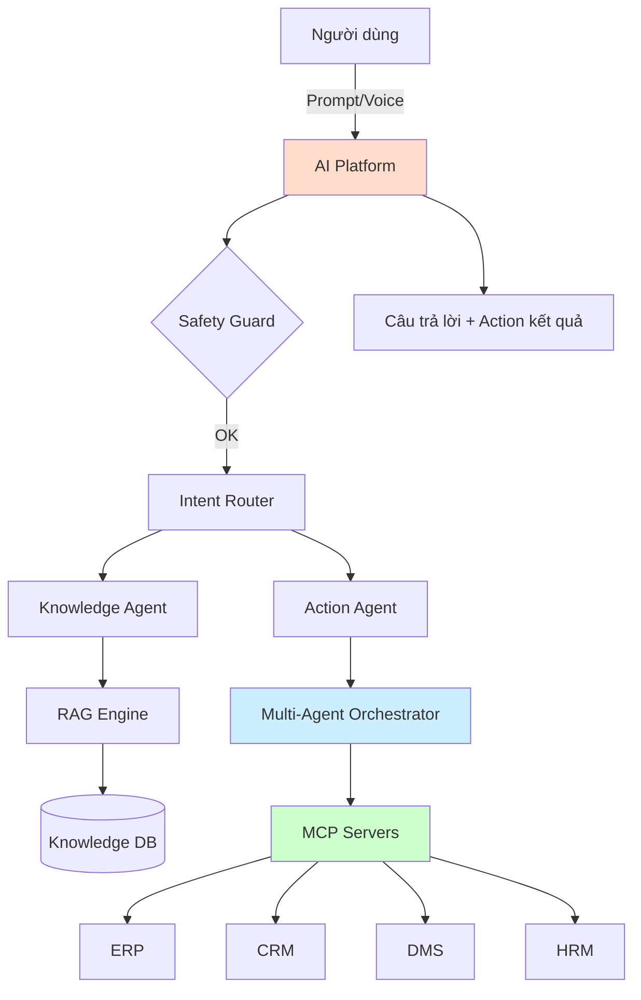
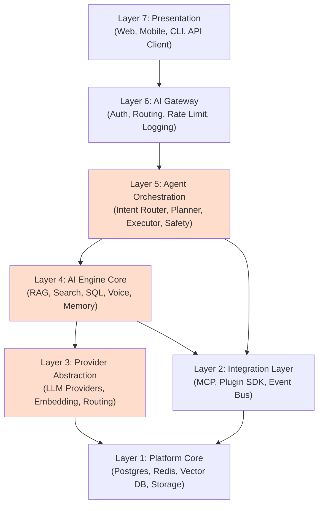
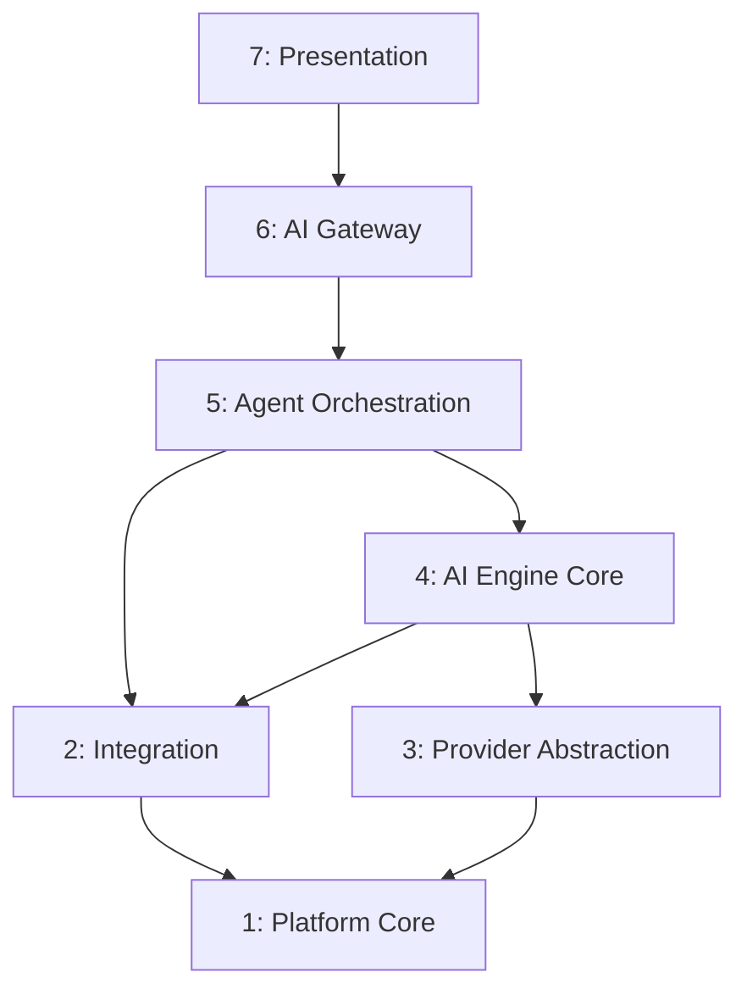
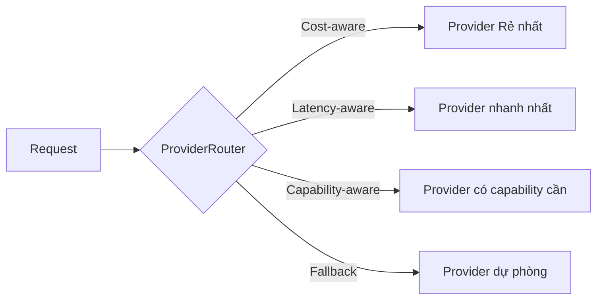
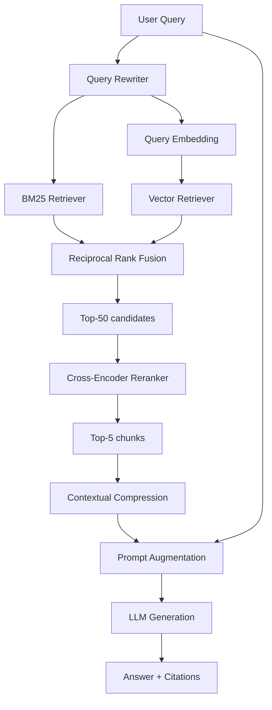
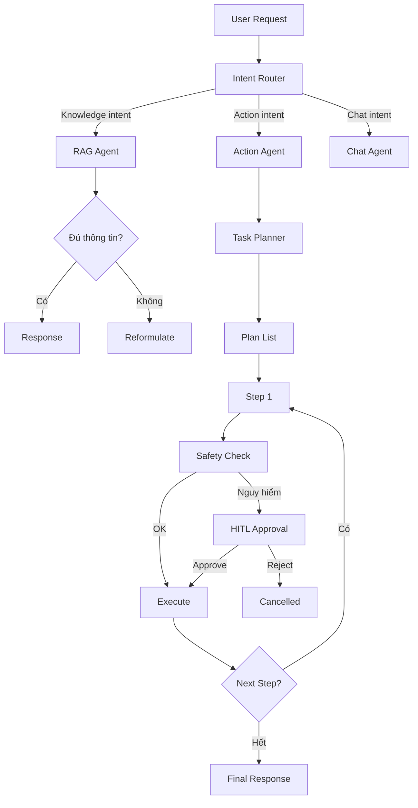
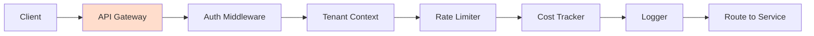
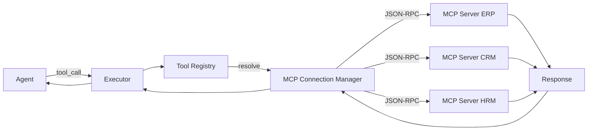
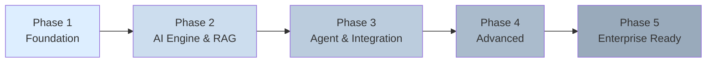
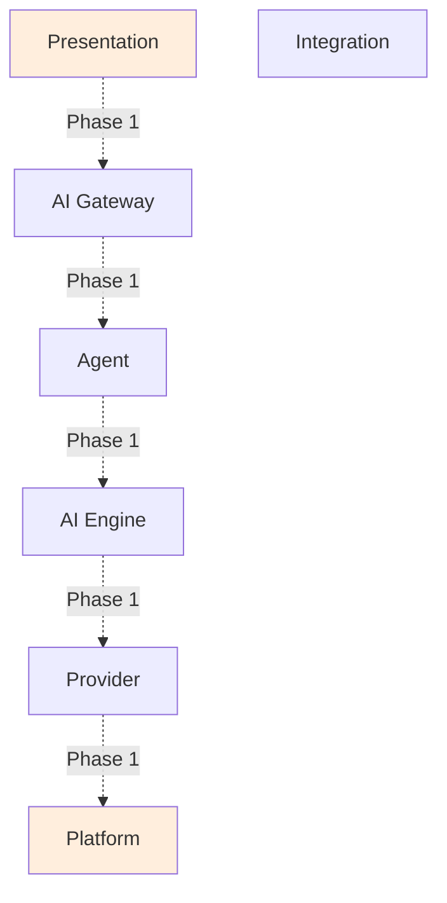

# Chương 2: PHÂN TÍCH BÀI TOÁN VÀ THIẾT KẾ NỀN TẢNG

Chương này trình bày quá trình phân tích bài toán, đề xuất kiến trúc tổng thể và thiết kế chi tiết các module cốt lõi của nền tảng Enterprise AI Platform. Nội dung gồm: phân tích yêu cầu chức năng – phi chức năng, nguyên tắc thiết kế, kiến trúc 7 tầng, thiết kế các module cốt lõi (Provider Abstraction, RAG Engine, Agent Orchestration, AI Gateway, Integration Layer), thiết kế dữ liệu và cơ sở tri thức, giao thức bảo mật, và chiến lược triển khai theo Phase.

## 2.1. Phân tích bài toán

### 2.1.1. Mô tả bài toán và bối cảnh doanh nghiệp

#### a) Bối cảnh

Các doanh nghiệp vừa và nhỏ tại Việt Nam đang vận hành một hệ sinh thái gồm nhiều hệ thống nghiệp vụ riêng lẻ (ERP, CRM, DMS, HRM, workflow…) do các nhà cung cấp khác nhau triển khai hoặc tự phát triển. Mỗi hệ thống có cơ sở dữ liệu, API và quy trình nghiệp vụ riêng. Khi muốn ứng dụng AI, doanh nghiệp đối mặt với các vấn đề:

- Triển khai AI cho mỗi hệ thống → đội ngũ phát triển phải học API riêng, cấu hình riêng.
- Dữ liệu và tri thức không liên thông giữa các hệ thống.
- Khi LLM provider thay đổi giá, chính sách → phải sửa mã nguồn.
- Không có cơ chế audit, permission-aware tập trung.

#### b) Bài toán đặt ra

Làm thế nào để xây dựng một nền tảng duy nhất giúp:
- Tích hợp AI vào nhiều hệ thống khác nhau mà không phải sửa hệ thống đích.
- Chuyển đổi AI provider linh hoạt.
- Đảm bảo an toàn, quyền hạn, audit.
- Có khả năng mở rộng theo nhu cầu.

#### c) Mục tiêu

Một nền tảng **Enterprise AI Platform** tham chiếu có thể triển khai trong thực tế với:
- **Plug & Play**: tích hợp hệ thống mới chỉ trong vài giờ, không phải vài tuần.
- **Provider Agnostic**: thay đổi OpenAI, Claude, Gemini, Llama local không ảnh hưởng business logic.
- **Domain Aware**: AI hiểu được business context, hỗ trợ tiếng Việt.
- **Enterprise Grade**: bảo mật, audit, multi-tenant, HA/DR.

### 2.1.2. Yêu cầu chức năng

Dựa trên khảo sát thực tế và phân tích của đề tài, các yêu cầu chức năng chính của nền tảng bao gồm:

#### a) Nhóm chức năng tra cứu tri thức (Knowledge Retrieval)
- **FR-01**: hỗ trợ upload, index và tìm kiếm tài liệu doanh nghiệp (PDF, DOCX, Markdown, TXT).
- **FR-02**: cung cấp hybrid search (vector + BM25) với reranking để tăng độ chính xác.
- **FR-03**: trả lời câu hỏi dựa trên tài liệu (RAG) với citation (trích dẫn nguồn).
- **FR-04**: hỗ trợ đa ngôn ngữ (tiếng Việt, tiếng Anh).

#### b) Nhóm chức năng AI Agent & Automation
- **FR-05**: agent có khả năng hiểu intent tự nhiên và lập kế hoạch đa bước.
- **FR-06**: agent gọi được tool/method qua MCP hoặc function calling.
- **FR-07**: multi-agent orchestration với các pattern sequential, hierarchical, debate.
- **FR-08**: HITL (Human-in-the-Loop) approval cho action nguy hiểm.

#### c) Nhóm chức năng tích hợp hệ thống
- **FR-09**: MCP server cho phép AI gọi tool từ ERP, CRM, DMS, HRM.
- **FR-10**: plugin SDK cho phép thêm connector mới.
- **FR-11**: REST API tiêu chuẩn cho client tích hợp.
- **FR-12**: webhook/event-driven cho cập nhật thời gian thực.

#### d) Nhóm chức năng Voice AI (nâng cao)
- **FR-13**: speech-to-text hỗ trợ tiếng Việt.
- **FR-14**: text-to-speech cho phản hồi bằng giọng nói.
- **FR-15**: voice command pipeline: STT → Intent → Action → Response.

#### e) Nhóm chức năng quản trị & governance
- **FR-16**: quản lý user, role, permission (RBAC, ABAC).
- **FR-17**: audit log cho mọi AI action.
- **FR-18**: multi-tenant với tenant isolation.
- **FR-19**: cost & usage tracking.
- **FR-20**: policy enforcement (ví dụ: cấm SQL write, giới hạn loại action).

### 2.1.3. Yêu cầu phi chức năng

| Mã | Yêu cầu | Mô tả | Tiêu chí đạt |
|---|---|---|---|
| NFR-01 | Hiệu năng | Latency trung bình | P95 ≤ 3s cho RAG đơn; ≤ 8s cho multi-agent |
| NFR-02 | Khả năng mở rộng | Hỗ trợ tải tăng theo chiều ngang | Scale đến 10K user/tenant, 1M documents |
| NFR-03 | Sẵn sàng cao (HA) | Uptime ≥ 99.5% | Triển khai multi-AZ, có failover |
| NFR-04 | Bảo mật | Authentication, authorization | JWT + RBAC + ABAC, audit log |
| NFR-05 | Khả năng bảo trì | Module hóa rõ ràng | Mỗi module độc lập, có API contract |
| NFR-06 | Khả năng phát triển | Triển khai theo Phase | Mỗi Phase có sản phẩm chạy được |
| NFR-07 | Tương thích | Hỗ trợ nhiều LLM | ≥ 3 provider qua interface chuẩn |
| NFR-08 | Khả chuyển | Có thể chuyển provider | Provider abstraction chuẩn hóa |
| NFR-09 | Chi phí | Chi phí vận hành thấp | ≤ 0.001 USD/query trung bình |
| NFR-10 | Đa ngôn ngữ | Tiếng Việt + tiếng Anh | Embedding + LLM hỗ trợ |
| NFR-11 | Offline-first | Chạy được không cần Internet | Ollama + local mode |
| NFR-12 | Tuân thủ | GDPR-like compliance | PII detection, data residency |

### 2.1.4. Use case tổng quát



*Hình 2.2: Use case tổng quát của nền tảng*

### 2.1.5. Phân tích các bên liên quan (Stakeholders)

| Bên liên quan | Vai trò | Mối quan tâm |
|---|---|---|
| Người dùng cuối | Sử dụng AI để tra cứu, tự động hóa | Trải nghiệm, tốc độ, chính xác |
| Quản trị viên tenant | Cấu hình, quản lý user | UI dễ dùng, audit log, RBAC |
| Lập trình viên tích hợp | Build MCP server, plugin | SDK rõ ràng, documentation |
| Kiến trúc sư AI | Thiết kế prompt, workflow | Multi-provider, version prompt |
| Đội vận hành | Triển khai, giám sát | Observability, scaling, HA |
| Bảo mật | Audit, compliance | Audit log, encryption, policy |

## 2.2. Kiến trúc tổng thể nền tảng

### 2.2.1. Nguyên tắc thiết kế

Kiến trúc nền tảng tuân thủ 8 nguyên tắc thiết kế cốt lõi:

1. **Plug & Play**: hệ thống ngoài (ERP, CRM, DMS) chỉ cần build một MCP server hoặc plugin → AI Platform tự kết nối.
2. **Provider Agnostic**: business logic không phụ thuộc AI provider cụ thể; thay đổi provider chỉ qua config.
3. **Domain Aware**: AI có khả năng hiểu schema, business rule, tiếng Việt thông qua metadata layer.
4. **Event Driven**: các module giao tiếp chủ yếu qua event (khi phù hợp), giảm coupling.
5. **Agent Native**: AI Agent là first-class citizen, không phải add-on.
6. **Offline First**: thiết kế để chạy được hoàn toàn local (Ollama, PostgreSQL local) khi không có Internet.
7. **Enterprise Grade**: bảo mật, audit, HA, multi-tenant là yêu cầu không thể thỏa hiệp.
8. **Multi-Tenant**: thiết kế cho nhiều tenant ngay từ đầu, sử dụng row-level security và tenant-aware context.

### 2.2.2. Kiến trúc 7 tầng (Layered Architecture)

Đề tài đề xuất kiến trúc 7 tầng cho Enterprise AI Platform:



*Hình 2.3: Kiến trúc 7 tầng của nền tảng Enterprise AI Platform*

#### Vai trò của từng tầng:

**Layer 1 – Platform Core (Nền tảng hạ tầng)**:
- PostgreSQL + pgvector: lưu trữ quan hệ + vector.
- Redis: cache, session, rate-limit.
- MinIO/S3: object storage cho tài liệu.
- Ollama: LLM local (optional).
- Message Broker: RabbitMQ/Kafka cho event-driven.

**Layer 2 – Integration Layer (Tầng tích hợp)**:
- MCP Server/Client: giao tiếp AI – hệ thống ngoài theo chuẩn.
- Plugin SDK: cho phép load plugin runtime (DLL, container).
- Event Bus: pub/sub giữa các module.
- Webhook & Outbound Connector: gửi event ra ngoài.

**Layer 3 – Provider Abstraction (Tầng trừu tượng hóa nhà cung cấp)**:
- ILLMProvider interface: contract cho mọi LLM.
- IEmbeddingProvider interface: contract cho embedding model.
- ProviderRouter: chọn provider tối ưu theo cost, latency, capability.
- ProviderRegistry: quản lý danh sách provider khả dụng.
- Implementation: Ollama, OpenAI, Anthropic, Azure OpenAI, Gemini.

**Layer 4 – AI Engine Core (Lõi AI Engine)**:
- RAG Engine: Hybrid Search + Reranking + Generation.
- Text-to-SQL Engine: truy vấn DB tự nhiên.
- Voice Engine: STT, TTS.
- Memory Manager: short-term, long-term memory.
- Prompt Engine: prompt template, version, A/B test.
- Workflow Engine: BPMN-like workflow execution.

**Layer 5 – Agent Orchestration (Tầng điều phối Agent)**:
- Intent Router: phân loại user intent.
- Task Planner: sinh plan từ intent (ReAct, Plan-and-Execute).
- Executor: thực thi từng bước plan.
- Tool Registry: quản lý các tool (MCP, internal API).
- Safety Guard: validate action, phát hiện prompt injection, hallucination.
- HITL Approval: workflow duyệt cho action nhạy cảm.

**Layer 6 – AI Gateway (Cổng AI)**:
- Authentication & Authorization (JWT, OAuth, OIDC).
- Multi-tenant routing.
- Rate limiting & quota.
- Logging & observability.
- Request transformation.

**Layer 7 – Presentation (Lớp trình bày)**:
- Web Admin: Next.js 14, Tailwind.
- Chat UI: giao diện hội thoại.
- Document Manager: upload, browse, search.
- Agent Console: theo dõi agent run, xem plan.
- API Client & SDK cho developer.

### 2.2.3. So sánh với các phong cách kiến trúc khác

| Kiếu kiến trúc | Ưu điểm | Nhược điểm | Đánh giá cho đề tài |
|---|---|---|---|
| Monolith | Đơn giản, dễ phát triển ban đầu | Khó scale, khó bảo trì khi lớn | Không phù hợp |
| Modular Monolith | Module hóa rõ ràng, đơn giản vận hành, dễ tách microservice sau | Giới hạn scale một số module | **Phù hợp giai đoạn đầu** |
| Microservice | Scale độc lập, đa ngôn ngữ | Phức tạp vận hành, overhead | Phù hợp giai đoạn sau |
| Hybrid (Modular Monolith → Microservice) | Cân bằng đơn giản – mở rộng | Cần thiết kế boundary cẩn thận | **Lựa chọn của đề tài** |
| Serverless | Tự động scale, pay-as-you-go | Cold start, debugging khó | Phù hợp một số workload |
| Plugin-based | Mở rộng linh hoạt | Quản lý plugin runtime phức tạp | Bổ sung cho Hybrid |

*Bảng 2.1: So sánh các phong cách kiến trúc*

Đề tài lựa chọn **Hybrid Architecture** với hai giai đoạn:
- **Giai đoạn đầu (Phase 1-3)**: Modular Monolith + Plugin SDK để phát triển nhanh, dễ debug.
- **Giai đoạn sau (Phase 4-5)**: tách một số module (RAG Engine, Provider Abstraction) thành microservice độc lập.

### 2.2.4. Dependency Flow



*Hình 2.4: Dependency Flow giữa các layer*

Nguyên tắc:
- Mỗi layer chỉ gọi layer kề dưới hoặc cùng tầng.
- Layer 5 (Agent) gọi cả Layer 4 (AI Engine) và Layer 2 (Integration) vì cần cả LLM lẫn tool.
- Layer 3 (Provider Abstraction) là leaf – chỉ gọi Layer 1.
- Layer 1 (Platform Core) không được gọi ngược lên.

## 2.3. Thiết kế các module cốt lõi

### 2.3.1. AI Provider Abstraction Layer

#### a) Mục tiêu

Provider Abstraction Layer (PAL) là tầng quan trọng nhất để đạt mục tiêu "Provider Agnostic". Tầng này định nghĩa interface chuẩn cho mọi LLM/Embedding provider và cung cấp cơ chế routing thông minh.

#### b) Thiết kế interface

```csharp
public interface ILLMProvider
{
    string Name { get; }
    Task<CompletionResponse> CompleteAsync(CompletionRequest req, CancellationToken ct);
    IAsyncEnumerable<Token> StreamAsync(CompletionRequest req, CancellationToken ct);
    Task<float[]> EmbedAsync(string text, CancellationToken ct);
    ProviderCapabilities Capabilities { get; }
}

public interface IEmbeddingProvider
{
    string Name { get; }
    int Dimensions { get; }
    Task<float[][]> EmbedBatchAsync(string[] texts, CancellationToken ct);
}
```

#### c) Triển khai

| Provider | LLM | Embedding | Ghi chú |
|---|---|---|---|
| Ollama (local) | ✓ | ✓ | Llama 3.2, Mistral, nomic-embed |
| OpenAI | ✓ | ✓ | GPT-4o, text-embedding-3-small |
| Anthropic Claude | ✓ | – | Claude 3.5/4 |
| Azure OpenAI | ✓ | ✓ | Enterprise contract |
| Google Gemini | ✓ | ✓ | Gemini 2.5 Flash/Pro |

*Bảng 2.3: Thông số các LLM provider được hỗ trợ*

#### d) ProviderRouter – routing thông minh



*Hình 2.5: Module Provider Abstraction Layer*

ProviderRouter chọn provider dựa trên:
- **Cost**: provider rẻ nhất cho task đơn giản (routing query).
- **Latency**: provider gần nhất/respon nhanh nhất.
- **Capability**: provider có chức năng cần (ví dụ: vision, function calling).
- **Availability**: nếu provider A fail → fallback sang B.
- **Tenant preference**: tenant được phép config provider ưu tiên.

### 2.3.2. AI Engine Core – RAG Engine và Hybrid Search

#### a) Tổng quan module RAG Engine

RAG Engine thực hiện quy trình retrieval-augmented generation hoàn chỉnh với các tính năng nâng cao:

- **Indexing Pipeline**: tải tài liệu → chunk → embedding → vector storage.
- **Query Pipeline**: rewrite query → hybrid search → rerank → augment → generate.
- **Citation**: mỗi câu trả lời gắn với nguồn tài liệu.
- **Streaming**: sinh câu trả lời theo token.

#### b) Luồng xử lý RAG với Hybrid Search



*Hình 2.6: Luồng xử lý RAG với Hybrid Search*

#### c) Các kỹ thuật nâng cao

- **Chunking Strategy**: recursive chunking với overlap 100-200 token, respect section headers, giữ semantic coherence.
- **Embedding Models**: 
  - Tiếng Anh: OpenAI `text-embedding-3-small`, Google `gemini-embedding-001`, BGE-large.
  - Tiếng Việt: `bkai-foundation-models/vietnamese-bi-encoder`, `intfloat/multilingual-e5-large`.
- **Hybrid Search kết hợp**:
  - Vector search qua pgvector (cosine distance).
  - BM25 qua PostgreSQL full-text search hoặc Elasticsearch.
  - RRF (Reciprocal Rank Fusion) kết hợp kết quả.

| Cơ chế Reranking | Ưu điểm | Nhược điểm | Ghi chú |
|---|---|---|---|
| Không rerank | Nhanh | Độ chính xác thấp | Baseline |
| Cross-Encoder (BGE-reranker) | Chính xác cao | Chậm với corpus lớn | Phù hợp top-50 |
| LLM-based Rerank | Rất chính xác | Tốn token, chậm | Dùng cho top-20 quan trọng |
| Cohere Rerank API | Dễ tích hợp | Vendor lock-in | Chi phí per request |

*Bảng 2.4: So sánh các cơ chế reranking*

#### d) RAG Engine API

```http
POST /api/v1/rag/query
{
  "query": "Quy trình xin nghỉ phép là gì?",
  "tenant_id": "tenant-1",
  "collection": "policy-docs",
  "top_k": 5,
  "use_rerank": true,
  "stream": true
}
```

Response:
```json
{
  "answer": "Theo quy trình HR-001...",
  "citations": [
    {"doc_id": "doc-1", "chunk_id": "c-12", "score": 0.92, "text": "..."},
    ...
  ],
  "metadata": {
    "tokens_used": 850,
    "latency_ms": 1850,
    "provider": "gemini-2.5-flash",
    "retrieval_count": 50,
    "rerank_count": 5
  }
}
```

### 2.3.3. Agent Orchestration Layer

#### a) Cấu trúc module

Agent Orchestration Layer gồm các thành phần phối hợp:

- **Intent Router** (phân loại intent): dùng LLM hoặc classifier để xác định user muốn gì (search, action, chat).
- **Task Planner**: sinh plan (chuỗi bước) để hoàn thành task, sử dụng Plan-and-Execute, ReAct hoặc Tree-of-Thought.
- **Executor**: thực thi từng bước, gọi tool, nhận kết quả.
- **Tool Registry**: lưu danh sách tool (MCP tools, internal API).
- **Safety Guard**: kiểm tra action có hợp lệ, không nguy hiểm.
- **Memory**: short-term (RAM), long-term (vector DB + structured DB).
- **HITL Approval**: workflow approval cho action nguy hiểm.

#### b) Workflow điển hình



*Hình 2.7: Agent Orchestration workflow*

#### c) Tool Calling & MCP Integration

Agent gọi tool qua cơ chế:

1. LLM nhận system prompt liệt kê tool khả dụng (từ Tool Registry).
2. LLM sinh `tool_call` (JSON) với tên tool + arguments.
3. Executor parse JSON, validate schema, gọi tool qua MCP hoặc internal API.
4. Kết quả trả về LLM, tiếp tục plan hoặc trả response.

Ví dụ JSON-RPC call:
```json
{
  "method": "tools/call",
  "params": {
    "name": "create_leave_request",
    "arguments": {
      "employee_id": "EMP001",
      "from_date": "2026-08-01",
      "to_date": "2026-08-03",
      "reason": "Nghỉ phép năm"
    }
  }
}
```

#### d) Multi-Agent Pattern

Đề tài hỗ trợ ba pattern phối hợp:

- **Sequential Pipeline**: Researcher Agent → Analyzer Agent → Writer Agent.
- **Supervisor Pattern**: Supervisor Agent điều phối các sub-agent.
- **Debate Pattern**: hai Agent đề xuất, một Verifier Agent chọn.

#### e) Safety Guard

Safety Guard bao gồm:
- **Prompt Injection Detection**: phát hiện prompt độc hại.
- **Dangerous Action Check**: chặn SQL write, file delete ngoài whitelist, API calls ngoài scope.
- **PII Filter**: ẩn thông tin nhạy cảm trong input/output.
- **Rate Limit**: giới hạn số tool call / step.
- **Audit Log**: ghi log mọi action.

### 2.3.4. AI Gateway Layer

#### a) Chức năng chính

AI Gateway là entry point cho tất cả request từ client. Cung cấp:

- **Authentication & Authorization**: JWT validate, OAuth flow.
- **Tenant Routing**: route request đến tenant config đúng.
- **Rate Limiting**: per-user, per-tenant, per-API.
- **Cost Tracking**: tính chi phí token, charge-back cho tenant.
- **Logging & Tracing**: distributed tracing (OpenTelemetry).
- **Request Transformation**: thêm context, sanitize input.

#### b) Kiến trúc



#### c) Authentication

- JWT với RS256 signing.
- OAuth 2.0 với PKCE cho web app.
- OIDC cho SSO tích hợp SAML.
- API Key cho service-to-service.

#### d) Tenant Context

Mỗi request gắn với `tenant_id` được extract từ JWT. Tenant context truyền qua downstream service qua HTTP header `X-Tenant-Id` hoặc qua async-local storage trong code.

### 2.3.5. Integration Layer – MCP và Plugin SDK

#### a) MCP Server & Client

Đề tài tích hợp MCP như first-class citizen:

- **MCP Server**: Platform đóng vai trò MCP server, expose các tool nội bộ (RAG, Agent execution, Document management).
- **MCP Client**: Platform kết nối tới MCP server của hệ thống ngoài (ERP, CRM, DMS).
- **Transport hỗ trợ**: stdio (subprocess), HTTP+SSE, Streamable HTTP.

Ví dụ MCP server cho HRM:
```json
{
  "tools": [
    {
      "name": "get_employee_info",
      "description": "Lấy thông tin nhân viên theo ID",
      "input_schema": {
        "type": "object",
        "properties": {
          "employee_id": {"type": "string"}
        },
        "required": ["employee_id"]
      }
    },
    {
      "name": "create_leave_request",
      "description": "Tạo đơn xin nghỉ phép",
      "input_schema": {...}
    }
  ]
}
```

#### b) Plugin SDK

Plugin SDK cho phép thêm connector mà không cần sửa core:

```csharp
public interface IConnectorPlugin
{
    string Name { get; }
    string Version { get; }
    Task<ConnectorManifest> GetManifestAsync();
    Task<JsonNode> ExecuteAsync(string operation, JsonNode args, CancellationToken ct);
}
```

Plugin được load từ DLL hoặc Docker container, có hot-reload, version management.

#### c) Event Bus

Event Bus cho phép giao tiếp loose-coupled giữa các module:

- **Topics**: `document.indexed`, `agent.completed`, `mcp.tool.called`, `audit.event`.
- **Implementation**: in-process (MediatR) cho monolith ban đầu, RabbitMQ/Kafka cho microservice sau.
- **Outbox Pattern**: đảm bảo delivery semantics.

## 2.4. Thiết kế dữ liệu và cơ sở tri thức

### 2.4.1. Mô hình dữ liệu quan hệ (PostgreSQL)

Cơ sở dữ liệu chính sử dụng PostgreSQL 16 với schema thiết kế theo multi-tenant và audit. Các nhóm bảng chính:

**Nhóm 1 – Identity & Tenant**:
- `tenants`: thông tin tenant (id, name, config, status).
- `users`: người dùng.
- `roles`: vai trò (admin, operator, viewer...).
- `permissions`: quyền cụ thể.
- `user_roles`: mapping user-role.
- `role_permissions`: mapping role-permission.

**Nhóm 2 – Documents & Knowledge**:
- `documents`: tài liệu (id, tenant_id, name, file_path, mime, upload_time, status).
- `document_chunks`: chunk đã embedding (id, document_id, chunk_index, content, embedding vector(1536), metadata).
- `collections`: nhóm tài liệu (collection = knowledge base).
- `collection_documents`: mapping.

**Nhóm 3 – Conversations & Memory**:
- `conversations`: phiên chat.
- `messages`: tin nhắn trong conversation.
- `memory_items`: long-term memory.
- `feedback`: đánh giá của user.

**Nhóm 4 – Agent & Audit**:
- `agent_runs`: mỗi lần agent thực thi.
- `agent_steps`: từng bước trong plan.
- `tool_calls`: mỗi tool call.
- `audit_logs`: log cho mọi action.
- `usage_records`: token, cost tracking.

### 2.4.2. Cơ sở dữ liệu vector (pgvector)

Sử dụng extension pgvector để lưu trữ embedding:

```sql
CREATE EXTENSION IF NOT EXISTS vector;

CREATE TABLE document_chunks (
    id UUID PRIMARY KEY,
    tenant_id UUID NOT NULL,
    document_id UUID NOT NULL,
    chunk_index INT NOT NULL,
    content TEXT NOT NULL,
    embedding vector(1536),
    metadata JSONB,
    created_at TIMESTAMPTZ DEFAULT NOW()
);

-- Index cho cosine similarity
CREATE INDEX ON document_chunks
USING ivfflat (embedding vector_cosine_ops)
WITH (lists = 100);

-- Row-Level Security
ALTER TABLE document_chunks ENABLE ROW LEVEL SECURITY;
CREATE POLICY tenant_isolation ON document_chunks
USING (tenant_id = current_setting('app.current_tenant')::UUID);
```

### 2.4.3. So sánh các Vector Database

| Vector DB | Ưu điểm | Nhược điểm | Phù hợp |
|---|---|---|---|
| pgvector | Đơn giản, dùng chung PostgreSQL | Scale vừa | **Đề tài chọn** |
| Qdrant | Nhanh, nhiều tính năng | Phải vận hành riêng | Doanh nghiệp lớn |
| Milvus | Scale lớn | Phức tạp | Production massive |
| Pinecone | SaaS, đơn giản | Vendor lock-in, cost | POC nhanh |
| Weaviate | Multi-modal | Tài nguyên nhiều | Đặc thù |
| FAISS (lib) | Nhanh, local | Không có metadata | Nghiên cứu |

*Bảng 2.5: So sánh các vector database phổ biến*

Đề tài chọn **pgvector** vì: đơn giản vận hành, dùng chung PostgreSQL với dữ liệu quan hệ, hỗ trợ RLS cho multi-tenant, đủ hiệu năng cho quy mô thực nghiệm.

### 2.4.4. Multi-Tenant với Row-Level Security

```sql
-- Function set tenant context
CREATE OR REPLACE FUNCTION set_tenant(tenant_uuid UUID)
RETURNS VOID AS $$
BEGIN
    PERFORM set_config('app.current_tenant', tenant_uuid::TEXT, true);
END;
$$ LANGUAGE plpgsql;

-- Enable RLS on tables
ALTER TABLE document_chunks ENABLE ROW LEVEL SECURITY;
CREATE POLICY doc_chunks_tenant ON document_chunks
USING (tenant_id::TEXT = current_setting('app.current_tenant', true));
```

Mỗi request mở transaction với `BEGIN; SELECT set_tenant(...); ...` để đảm bảo tenant isolation tự động.

### 2.4.5. Enterprise Knowledge Base

Enterprise Knowledge Base là nơi tổ chức tri thức doanh nghiệp:

| Bảng | Mô tả |
|---|---|
| `kb_collections` | Nhóm tri thức (HR, Product, Policy...) |
| `kb_documents` | Tài liệu trong knowledge base |
| `kb_metadata` | Metadata cho mỗi tài liệu (domain, language, version, owner) |
| `kb_glossary` | Domain glossary - mapping thuật ngữ riêng doanh nghiệp |
| `kb_ontologies` | Ontology cho business domain |

*Bảng 2.6: Cấu trúc các bảng metadata trong cơ sở tri thức*

Metadata giúp AI hiểu context: "tài liệu HR-Policy-2026", "áp dụng từ 01/01/2026", "phiên bản 2.1", "ngôn ngữ tiếng Việt", "phòng ban: nhân sự".

## 2.5. Thiết kế giao thức tích hợp và bảo mật

### 2.5.1. MCP Server và Client

#### a) Triển khai MCP Server trong Platform

Platform (Backend) đóng vai trì MCP server, expose các capability:

- **Tools**: `search_documents`, `create_report`, `query_database`, `execute_workflow`, `ask_expert_agent`.
- **Resources**: documents, collections, KB metadata.
- **Prompts**: predefined prompt templates.

MCP server chạy song song với REST API, cho phép các client AI-native (Claude Desktop, IDE) kết nối trực tiếp qua MCP.

#### b) Triển khai MCP Client

Trong tầng Integration, Platform là MCP client kết nối tới MCP server của hệ thống ngoài. Mỗi MCP server bên ngoài được wrap thành một `IMCPConnection` interface, cung cấp tool/resource cho Agent.

```csharp
public interface IMCPConnection
{
    string ServerName { get; }
    Task<List<Tool>> ListToolsAsync();
    Task<JsonNode> CallToolAsync(string name, JsonNode args);
}
```

#### c) MCP Flow khi Agent gọi tool



*Hình 2.8: MCP Server – Client flow*

### 2.5.2. Plugin Architecture

Plugin cho phép mở rộng Platform mà không cần fork core:

- **Plugin types**: connector, prompt template, custom tool, custom agent.
- **Loading**: dynamic load DLL hoặc Docker container.
- **Versioning**: plugin có version, có thể upgrade hoàn toàn hoặc in-place.
- **Hot-reload**: dev có thể update plugin mà không restart platform.
- **Isolation**: plugin chạy trong sandbox với permission riêng.
- **Marketplace**: tương lai có thể publish plugin cho cộng đồng.

### 2.5.3. Authentication, Authorization và Audit

#### a) Authentication

- **JWT** với RS256, có refresh token.
- **OAuth 2.0** với PKCE cho web SPA.
- **OIDC** cho SSO (tích hợp Azure AD, Google Workspace).
- **API Key** cho service-to-service (mỗi tenant có nhiều key với scope khác nhau).
- **mTLS** cho internal service communication.

#### b) Authorization

| Cơ chế | Ưu điểm | Nhược điểm | Phù hợp |
|---|---|---|---|
| RBAC | Đơn giản, dễ hiểu | Không scale với context phức tạp | Cơ bản |
| ABAC | Linh hoạt theo attribute | Phức tạp hơn | Doanh nghiệp |
| ReBAC | Mô hình quan hệ | Tốn storage | Workflow approval |
| Hybrid (RBAC + ABAC) | Cân bằng | Cần thiết kế cẩn thận | **Đề tài chọn** |

*Bảng 2.7: So sánh các cơ chế phân quyền RBAC, ABAC, RLS*

Platform kết hợp:
- **RBAC** cho role cơ bản: admin, operator, viewer.
- **ABAC** cho policy phức tạp: "chỉ manager phòng ban X mới approve đơn của nhân viên phòng X".
- **Row-Level Security (RLS)** ở database cho tenant isolation.

#### c) Audit Log

Mọi action quan trọng đều được log:

```sql
CREATE TABLE audit_logs (
    id UUID PRIMARY KEY,
    tenant_id UUID NOT NULL,
    user_id UUID,
    actor_type VARCHAR(50), -- user, agent, system
    action VARCHAR(100) NOT NULL,
    resource_type VARCHAR(50),
    resource_id VARCHAR(100),
    request_payload JSONB,
    response_payload JSONB,
    ip_address INET,
    user_agent TEXT,
    success BOOLEAN,
    error_message TEXT,
    created_at TIMESTAMPTZ DEFAULT NOW()
);

CREATE INDEX idx_audit_tenant_time ON audit_logs(tenant_id, created_at);
```

Audit log lưu trữ 90 ngày hot + archive lâu dài, đáp ứng compliance.

### 2.5.4. AI Safety và Governance

#### a) Prompt Security

- **System prompt isolation**: tách system prompt khỏi user input, dùng delimiter rõ ràng.
- **Prompt injection detection**: classifier phát hiện prompt injection trong user input.
- **Output filter**: kiểm tra output LLM có chứa PII, harmful content không.

#### b) Dangerous Action Prevention

- **SQL Write Prevention**: Text-to-SQL chỉ cho SELECT, không cho INSERT/UPDATE/DELETE/DROP.
- **File System Limit**: chỉ truy cập file trong whitelist folder.
- **API Scope**: mỗi MCP connection chỉ gọi được operation đã whitelist.
- **Privilege Escalation**: AI không thể tự grant permission cho mình.

#### c) Hallucination Prevention

- **Citation Required**: RAG response luôn có citation.
- **Confidence Score**: mỗi response có confidence score.
- **Self-Consistency Check**: chạy nhiều lần và so sánh.
- **Critical Question Detection**: câu hỏi quan trọng (liên quan tài chính, pháp lý) → HITL approval.

## 2.6. Quy trình triển khai theo Phase

### 2.6.1. Tổng quan 5 Phase

Đề tài đề xuất chiến lược triển khai 5 Phase, mỗi Phase có sản phẩm chạy được:

| Phase | Tên | Thời gian | Sản phẩm |
|---|---|---|---|
| 1 | Foundation | 4 tuần | Walking Skeleton + Auth + Chat base |
| 2 | AI Engine & RAG | 6 tuần | RAG đầy đủ, Hybrid Search, Reranking |
| 3 | Agent & Integration | 6 tuần | Multi-Agent + MCP + 3 connector |
| 4 | Advanced Features | 4 tuần | Voice, SQL, Workflow Engine, Memory |
| 5 | Enterprise Ready | 6 tuần | Multi-tenant đầy đủ, HA, K8s, Audit |

*Bảng 2.8: Mapping giữa các Phase và module tương ứng*



*Hình 2.9: Sơ đồ 5 Phase triển khai*

### 2.6.2. Walking Skeleton và Vertical Slice

**Walking Skeleton** là nguyên tắc: ngay từ đầu, xây dựng end-to-end flow tối thiểu nhưng đi qua tất cả các layer. Sau đó, mỗi Phase bổ sung chiều ngang (vertical slice).



*Hình 2.10: Nguyên tắc Walking Skeleton*

### 2.6.3. Chi tiết từng Phase

#### a) Phase 1 – Foundation (4 tuần)

**Mục tiêu**: Walking Skeleton end-to-end với tính năng tối thiểu.

- Backend .NET 8 + PostgreSQL + Redis + Docker Compose.
- REST API cho /chat, /auth.
- Chat UI đơn giản (Next.js).
- Provider Abstraction với 2 provider (Ollama + OpenAI).
- JWT authentication.
- Logging cơ bản.

**Sản phẩm**: hệ thống có thể chat với LLM, sử dụng được 2 provider, đã auth.

#### b) Phase 2 – AI Engine & RAG (6 tuần)

- Document upload + chunking.
- Embedding pipeline + pgvector storage.
- Hybrid Search (BM25 + Vector, RRF).
- Cross-Encoder Reranker.
- RAG API trả về answer + citations.
- Citation UI hiển thị nguồn.

**Sản phẩm**: hệ thống RAG hoàn chỉnh, tra cứu tài liệu nội bộ.

#### c) Phase 3 – Agent & Integration (6 tuần)

- Agent framework: Intent Router, Task Planner, Executor.
- Tool Registry + function calling.
- MCP Client tích hợp 3 mock servers (ERP, CRM, HRM).
- Multi-agent pattern (Supervisor).
- Safety Guard cơ bản + Audit log.

**Sản phẩm**: agent có thể tương tác với 3 hệ thống mock, log audit đầy đủ.

#### d) Phase 4 – Advanced Features (4 tuần)

- Voice Engine (STT với Whisper, TTS với XTTS).
- Text-to-SQL Engine.
- Workflow Engine BPMN.
- Memory Manager (short + long term).
- SQL RAG kết hợp.

**Sản phẩm**: hệ thống có voice, truy vấn SQL tự nhiên, workflow phức tạp.

#### e) Phase 5 – Enterprise Ready (6 tuần)

- Full multi-tenant với RLS.
- RBAC + ABAC đầy đủ.
- Advanced audit + compliance.
- Kubernetes deployment manifests.
- HA + auto-scaling.
- Observability (Prometheus + Grafana + Seq).
- Disaster Recovery.

**Sản phẩm**: nền tảng production-ready, có thể bán thương mại.

### 2.6.4. Quản lý Interface giữa các Phase

Mỗi module có interface chuẩn hóa, đảm bảo Phase sau không phá vỡ Phase trước:

- **Contract Testing**: Pact hoặc tương đương giữa client/server.
- **Feature Flags**: cho phép bật/tắt feature mới.
- **Semantic Versioning**: API version rõ ràng (v1, v2).
- **Backward Compatibility**: deprecate API cũ nhưng vẫn hỗ trợ.

### 2.6.5. Đội ngũ và quy trình

Để triển khai hiệu quả, đề tài đề xuất đội ngũ 8-12 người trải qua 4 squad:

- **AI/ML squad**: LLM, RAG, Agent (3-4 người).
- **Platform squad**: Backend, API, Provider (3-4 người).
- **Integration squad**: MCP, Connector (2-3 người).
- **Frontend & DevOps squad**: UI, CI/CD (2-3 người).

Quy trình Scrum 2 tuần/sprint, demo cuối sprint có stakeholder.

## 2.7. Kết luận chương 2

Chương 2 đã trình bày chi tiết quá trình phân tích bài toán và thiết kế nền tảng Enterprise AI Platform. Các đóng góp chính:

- **Về yêu cầu**: phân tích 20 yêu cầu chức năng và 12 yêu cầu phi chức năng, được nhóm theo 5 nhóm chức năng chính.
- **Về kiến trúc**: đề xuất kiến trúc 7 tầng (Presentation, AI Gateway, Agent Orchestration, AI Engine Core, Provider Abstraction, Integration Layer, Platform Core) với 8 nguyên tắc thiết kế cốt lõi.
- **Về thiết kế module**: chi tiết 5 module cốt lõi (Provider Abstraction với ILLMProvider interface, RAG Engine với Hybrid Search + Reranking, Agent Orchestration với Multi-Agent pattern, AI Gateway với tenant routing, Integration Layer với MCP + Plugin SDK).
- **Về thiết kế dữ liệu**: schema PostgreSQL với 4 nhóm bảng (Identity, Documents, Conversations, Agent), tích hợp pgvector, RLS cho multi-tenant, Enterprise Knowledge Base với metadata.
- **Về bảo mật**: MCP là first-class citizen, hybrid RBAC+ABAC, audit log đầy đủ, AI Safety với prompt injection detection, dangerous action prevention, hallucination prevention.
- **Về triển khai**: chiến lược 5 Phase với Walking Skeleton, mỗi Phase có sản phẩm chạy được, giao diện giữa các Phase được quản lý chặt chẽ.

Chương 3 sẽ trình bày quá trình triển khai thực nghiệm, đánh giá hiệu quả và so sánh với phương pháp truyền thống.

---

*Tóm tắt Chương 2*: Phân tích 20 yêu cầu chức năng + 12 yêu cầu phi chức năng; đề xuất kiến trúc 7 tầng với 8 nguyên tắc thiết kế; thiết kế chi tiết các module (Provider Abstraction, RAG Engine với Hybrid Search + Reranking, Agent Orchestration, AI Gateway, Integration Layer); mô hình dữ liệu PostgreSQL + pgvector với RLS multi-tenant; chiến lược triển khai 5 Phase với Walking Skeleton, mỗi Phase có sản phẩm chạy được.
