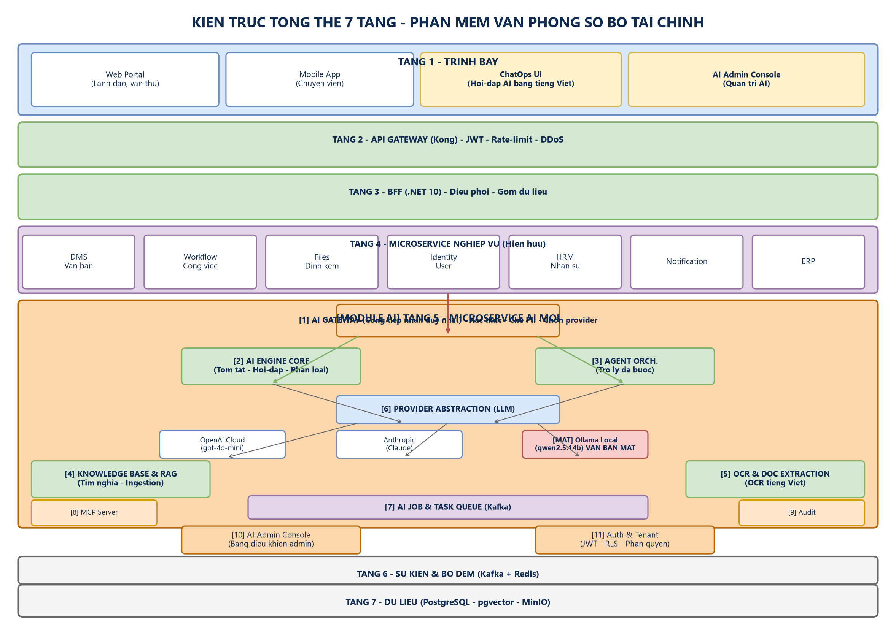
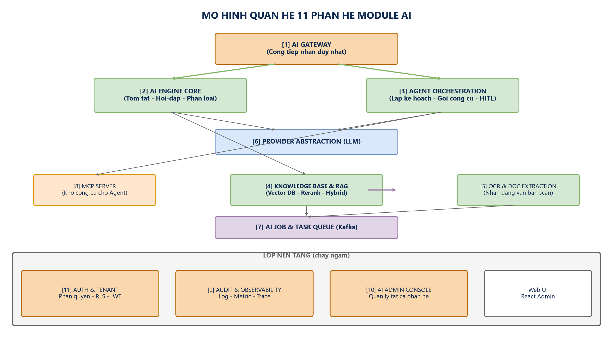
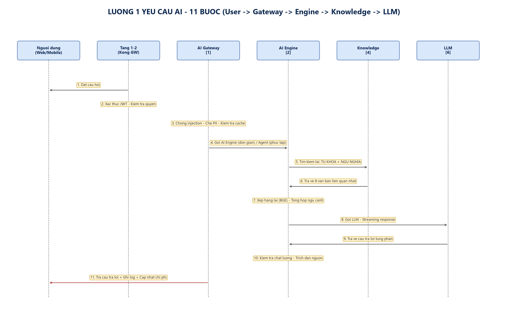
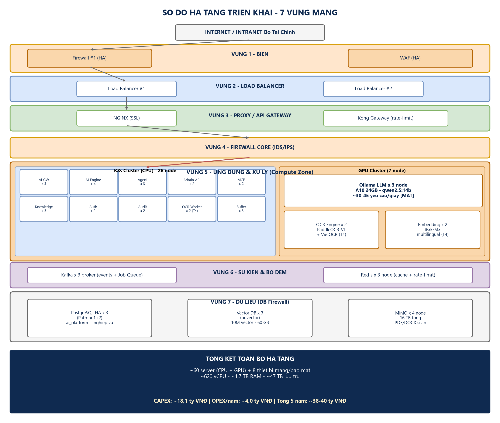
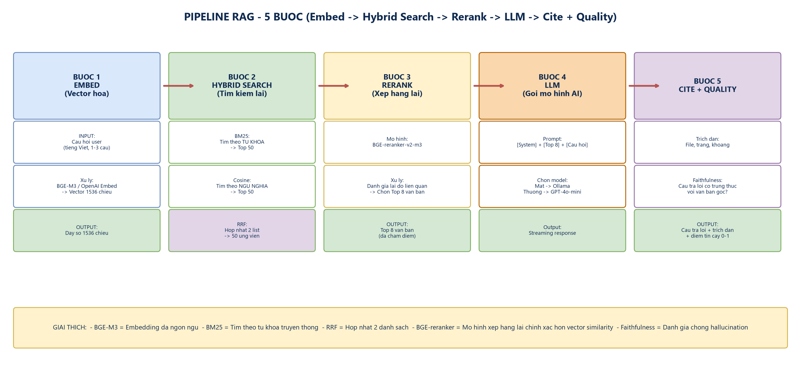
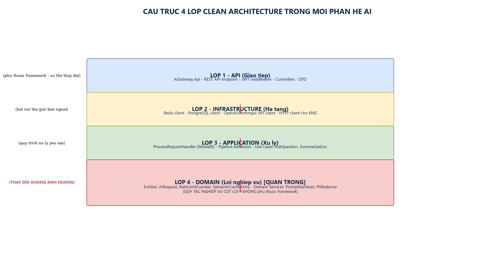
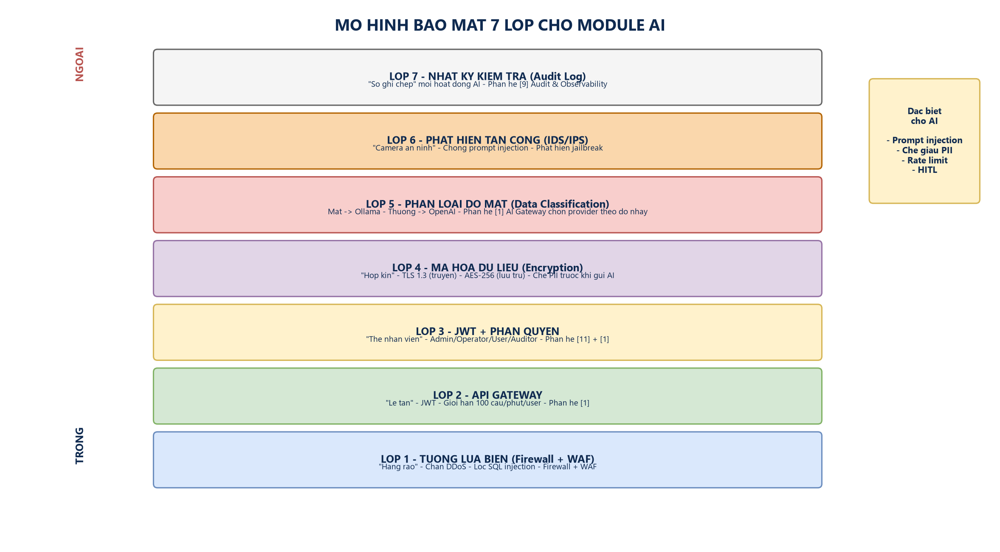

# 7 Sơ đồ Module AI - Module AI Bộ Tài Chính

> 7 file PNG chất lượng cao, dùng được ngay (kéo thả vào Word, slide, README, ...)

---

## 1. Kiến trúc tổng thể 7 tầng

> **Mô tả**: Toàn bộ Phần mềm Văn phòng số Bộ Tài Chính (bao gồm cả Module AI) được tổ chức thành 7 tầng, từ Trình bày (User) → API Gateway → BFF → Microservice nghiệp vụ → **Microservice AI (TẦNG 5 - TÂM ĐIỂM)** → Sự kiện & Bộ đệm → Dữ liệu.

## 2. Quan hệ 11 phân hệ AI

> **Mô tả**: 11 phân hệ AI và cách chúng phối hợp. Phân hệ ① AI Gateway là cổng tiếp nhận duy nhất; ② Engine Core xử lý yêu cầu đơn giản; ③ Agent xử lý đa bước; lớp nền tảng (Auth, Audit, Admin) chạy ngầm.

## 3. Luồng 1 yêu cầu AI (sequence)

> **Mô tả**: 11 bước từ lúc User gửi câu hỏi → qua 5 microservice → nhận câu trả lời streaming.

## 4. Hạ tầng 7 vùng mạng

> **Mô tả**: Internet → Firewall → Load Balancer → Kong Gateway → Firewall Core → K8s Cluster (CPU) + GPU Cluster → Kafka/Redis → PostgreSQL/Vector DB/MinIO.

## 5. Pipeline RAG chi tiết

> **Mô tả**: 5 bước xử lý 1 câu hỏi AI: Embed → Hybrid Search (BM25 + Cosine) → Rerank (BGE) → LLM (GPT-4o-mini hoặc Ollama) → Cite + Quality.

## 6. Clean Architecture 4 lớp

> **Mô tả**: Mỗi phân hệ AI được tổ chức theo 4 lớp: API → Infrastructure → Application → Domain (lõi nghiệp vụ).

## 7. Bảo mật 7 lớp cho AI

> **Mô tả**: 7 lớp bảo mật từ ngoài vào trong: Firewall → API Gateway → JWT → Encryption → Data Classification → IDS/IPS → Audit Log.

---

## Cách sử dụng

| Mục đích | Cách dùng |
|---|---|
| **Trong tài liệu Word** | Insert → Picture → chọn file PNG |
| **Trong slide PowerPoint** | Insert → Picture → chọn file PNG |
| **Trong file Markdown** | Dùng cú pháp `` |
| **Trong trang web** | Thẻ `` |
| **In ra giấy A3** | Chất lượng đủ rõ (300 DPI equivalent) |

## Thông số kỹ thuật

- Độ phân giải: 150 DPI
- Tỷ lệ: trang ngang (landscape), từ 20×11 đến 24×14 inches
- Định dạng: PNG với nền trắng
- Font: Segoe UI (Windows native) — hiển thị đầy đủ tiếng Việt
- Tổng dung lượng: ~1.3 MB cho cả 7 file

## Có thể chỉnh sửa?

Có. Nếu bạn muốn điều chỉnh (thêm/bớt thành phần, đổi màu, dịch sang tiếng Anh, ...), tôi có thể:
1. Chỉnh sửa file `generate_png.py` rồi chạy lại
2. Hoặc mở file PNG và dùng Paint/PowerPoint để chỉnh tay
3. Hoặc dùng file `.drawio` cũ (trong cùng folder) — mở bằng draw.io desktop, import thành công 100%